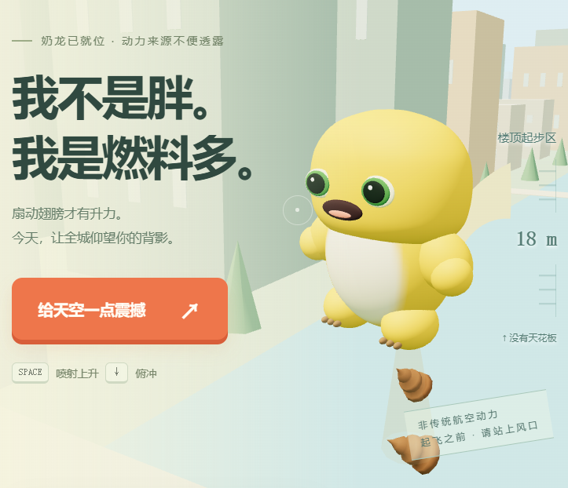

# 奶龙 · 3D 喷射起飞计划



真实 WebGL / Three.js 飞行场景。奶龙由程序生成的圆润曲面组成：绿色眼睛、浅浅笑线、奶油色肚皮、连续短手臂、粗短腿、茶色爪尖和渐细尾巴。背上一对龙翼是圆润前缘翼骨 + 后掠上翘的翼膜，后缘带扇贝缺口，扇动时根 / 腕 / 指逐段滞后。底下可喷便便、水柱或彩虹。保留追捕吐槽、穿圈计分和搞笑结算。

## 亮点

**画面**

- 奶龙与道具由程序曲面生成，角色模型无需加载外部模型或图片；手臂支持扇动、挥手，头部与眼睛支持转动和眨眼。
- 真实 3D 空域：随高度变化的天空与雾、程序化城市、云层、甜甜圈光环、巡逻无人机、飞鸟
- 三种喷射物（便便 / 水柱 / 彩虹），带尾流、重力下坠与各自音效

**手感**

- 真自由落体：v = v₀ + g·t，重力 58.86 m/s²，**没有终端速度** —— 掉得越久越快
- 只有扇翅才产生升力，松手立刻下坠；按 S / ↓ 进一步加大重力俯冲

**血量制度与交警**

- 每局 3 点生命，被抓或被撞扣 1 点，归零即结束
- **地面和楼房都是陷阱**：撞地 → 3 秒触地警告 → 交警起飞追捕 → **全场闪红灯**；爬升到 25 m 或用技能冲刺可以甩掉，被抓扣血
- 撞楼直接被抓；撞到巡逻无人机扣血；撞到飞鸟只扣分、不扣血
- 四个技能：清场 / 无敌冲刺 / 护盾 / 打滚，各有冷却与免疫判定

**体感操作**（摄像头，画面仅在浏览器本地识别，不会上传）

- 双臂连续上下扇动 = 爬升；身体左右倾斜 = 转向
- **三个技能手势**：双手交叉 → 脸皮护盾、单臂高举（奥特曼那种）→ 奶龙打滚、双臂向两侧张开 → 全场洗礼
- MediaPipe Pose **自托管**在 vendor/mediapipe/，不依赖第三方 CDN，可以离线运行

**工程化**

- 构建：压缩 JS/CSS + 内容哈希 + SEO/OG 注入 + Service Worker 预缓存清单
- PWA：可安装到桌面，**断网也能玩**
- 安全：严格 CSP、nosniff、Referrer-Policy、Permissions-Policy
- 生产服务器**零第三方依赖**：brotli 压缩、强缓存、条件请求（304）、路径穿越防护、/healthz 健康检查
- **64 项真实浏览器自检**（npm run verify）：落体物理、交警追捕、按钮流程、PWA 离线重载、控制台无异常

## 在线试玩

**👉 https://eurin-gu.github.io/FLY-NaiLong/**

手机浏览器直接打开就能玩，竖屏已适配。这个地址是 HTTPS，所以**体感摄像头模式也能用**。

📊 项目介绍 PPT：[奶龙喷射起飞计划.pptx（176 MB）](https://github.com/Eurin-gu/FLY-NaiLong/releases/latest/download/nailong-jet-flight-presentation.pptx)

> 超过 GitHub 单文件 100 MB 的限制，所以放在 Releases 里（从仓库首页右侧 Releases 也能进）。

## 运行

开发预览（源码直出，改完刷新即可）：

```bash
npm install          # 首次
npm run dev          # → http://127.0.0.1:4173
```

生产构建与运行：

```bash
npm run build        # 产出 dist/：压缩 + 内容哈希 + PWA + SEO
npm start            # → http://127.0.0.1:8080（读取 dist/）
```

`npm start` 监听 `0.0.0.0`，同一局域网的手机可直接访问（终端会打印地址），适合真机测试。也可以直接打开 `index.html`，但 Service Worker 离线能力与体感模式需要 HTTP(S) / localhost。

体感模式需要 localhost / HTTPS。人体姿态识别组件（MediaPipe Pose）已自托管在 `vendor/mediapipe/`（约 24 MB，仅在点击“开启体感”时按需加载）；该目录缺失时会自动回退到 jsDelivr CDN。视频仅在浏览器本地识别，不上传。切回手动模式会释放摄像头。

## 部署

线上跑在 **GitHub Pages**：推送到 `main` 就会自动构建并发布（[.github/workflows/deploy-pages.yml](.github/workflows/deploy-pages.yml)）。

```
改源码 → npm run release（本地构建 + 自检）→ git push → 自动上线
```

`dist/` 不入库，由 CI 从源码重建。

> ⚠️ GitHub Pages **不支持自定义响应头**，所以 `_headers` 里那套严格 CSP 在这个地址上不生效（HTTPS、缓存、PWA 离线都正常）。需要严格安全头就用 Cloudflare Pages / Netlify / 自有服务器。

其他方案见 [DEPLOY.md](DEPLOY.md)：Cloudflare Pages / Netlify / Vercel / Docker & 自有服务器，含一键上传步骤、自定义域名与上线检查清单。

最短路径：`npm run build`，然后把 `dist/` 文件夹拖到 <https://app.netlify.com/drop> 或 Cloudflare Pages 的 **Upload assets**，几十秒后就能拿到公网 HTTPS 地址。

## 生产环境自检

```bash
npm run verify          # 构建 + 启动生产服务器 + 真实浏览器全量检查（Windows）
npm run verify:build-only   # 同上，但不重新构建（改完源码已构建过）
npm run verify:http     # 只跑 HTTP 层，不需要浏览器
npm run verify:node     # 只跑 Node 层校验脚本（服务与浏览器需自己先起好）
```

会用真实的 Edge/Chrome 跑完整链路，结果写到 `output/verify/report.json`，截图在 `output/verify/`：

- **HTTP 契约**：状态码、CSP/安全响应头、`immutable` 强缓存、brotli 协商、`If-None-Match` → 304、目录穿越拦截、自定义 404、`/healthz`、PWA manifest、Service Worker 预缓存清单里的每个 URL 都能 200。
- **真实渲染**：WebGL 初始化成功、渲染失败兜底保持隐藏、按住空格后界面海拔从 18 m 升到 250 m 以上、暂停真的冻结模拟、喷射物切换、帮助弹窗、390×844 手机布局。
- **按钮流程**：首页「选玩法」能进「今天怎么飞？」、体感引导页签能解释转向、首飞四步练习能跳过、结算后「再喷一趟」不重复选玩法。
- **PWA / 离线**：Service Worker 注册并接管页面，**断网后重新加载仍能进入游戏**。
- **体感运行时**：自托管的 MediaPipe Pose 在当前 CSP 下能真正加载并跑完一次推理（用空白画布，无需摄像头）。
- **控制台卫生**：无未捕获异常、无 CSP 违规、无 4xx/5xx。

浏览器层需要真实 Chromium。Windows 直接用 `npm run verify`；其他平台可以手动起服务后接上任意已开启 CDP 的 Chromium：

```bash
BASE_URL=http://127.0.0.1:8080 CDP_URL=http://127.0.0.1:9222 node scripts/verify.mjs
BASE_URL=http://127.0.0.1:8080 node scripts/verify.mjs --http-only   # 只跑 HTTP 层
```

## 操作

- 空格 / W / ↑ / 喷射按钮：模拟连续扇翅并喷射上升。普通爬升最高 40 m/s，无高度上限。体感每次下扇提供 200 ms 升力，需要连续快速扇动才能持续爬升。
- 松手：保留上升惯性，随后进入**真正的自由落体**——重力持续加速，没有终端速度，掉得越久越快；S / ↓ 会再加大重力。落地停住，继续扇翅才会重新升空。
- 地面和楼房都是陷阱：撞到地面、在楼下赖着不走，或撞上建筑物，都会招来**交警追捕**。被他抓到扣 1 点耐久，血量归零就结束（自由模式自动恢复）；爬到 120 m 以上即可甩掉他。护盾 / 冲刺 / 打滚期间被摸到也不算。
- A / D / ← / →：左右飞行，横向位置也不受屏幕宽度限制。
- 拖动画面：上下左右操纵；手机按住画面上升、左右拖动转向，竖屏右下角是四个技能和暂停。
- Q：切换便便、水柱、彩虹，外观及操作音效随之切换。
- 1：清除附近前方追兵，冷却 8 秒。
- 2 / Shift：2.5 秒无敌加速，镜头视角扩大，冷却 9 秒。
- 3：6 秒护盾，冷却 12 秒。
- E / 奶龙打滚：翻滚闪避 0.85 秒，冷却 4 秒。翻滚避开撞击 +80 分，擦边飞过无人机 +35 分。
- P / Esc：暂停；切走页面自动暂停。F / ⛶：全屏。舞台右上角的 ↻ 立刻重开这一局。
- 首页三个入口：**开启摄像头**（体感校准后起飞）、**不用摄像头，触屏 / 键盘试玩**（直接自由飞行）、**选玩法**（进「今天怎么飞？」选自由飞行或 6 km 挑战，体感引导页签也在这里）。

模式在开局前（首页「选玩法」）或结算后（「换个玩法」）都能选。

自由模式可以无限飞行，三颗心用完自动恢复。6 km 挑战需要保持耐久飞到终点。想在局中换模式，可刷新回到首页。

穿过甜甜圈基础 +100 分，连续收集增加奖励；清场每架 +60 分，护盾 / 冲刺撞机 +30 分，通关 +500 分。最高海拔纪录保存在本地浏览器，与旧版分数纪录分开。

本轮修复（按钮点不动 / 翅膀）：

- **↻「重新开始」以前没有任何事件绑定**，在舞台上完全点不动。现在它会立刻重开当前这一局。
- **「再喷一趟」不再等摄像头**：以前它会 `await enableCamera()`（上限 120 秒）并把自己禁用，手机上的权限弹窗一被挂起，这个按钮就一直是灰的。现在立刻开局，摄像头在后台继续连，连上自动切体感，连不上就继续用键盘 / 触屏。
- **体感校准不再把人锁住**：以前摄像头连上后，如果一直没识别到扇翅，主按钮会永远停在「等待你的动作…」。现在旁边有明确的「跳过校准，先用键盘 / 触屏 →」，并且 25 秒没有任何动作就自动退回「今天怎么飞？」。侧栏的「开启体感」也加了超时兜底，不会永远转圈。
- **首页多了「选玩法」入口**：以前新玩家第一局被强制自由飞行，「6 km 挑战」只能等结算后点「换个玩法」才能选到。
- **`npm run verify` 恢复可用**：npm script 原来只指向 `scripts/verify.mjs`（它不自建服务、也不起浏览器），现在指向 `scripts/verify.ps1` 的完整流水线；只跑 Node 层用 `npm run verify:node`，只跑 HTTP 层用 `npm run verify:http`。
- **`npm run dev` 不再一片 404**：本地预览服务器现在会回退到 `public/`，`/nailong.png`（加载页那只奶龙）和 `/sfx/*.ogg`、`/music/bgm.ogg` 都能正常加载，音频也带上了正确的 MIME。
- **翅膀重做**：原来是五颗椭球排成一串，从背后看像两条毛毛虫。现在是一片真正的龙翼——圆润的前缘翼骨 + 后掠上翘的翼膜，后缘两个扇贝缺口，翼展方向分根 / 腕 / 指三段，扇动时逐段滞后。

本轮手感改进：停止扇翅后保留惯性并受重力下坠；目标提示同时显示左右和上下偏差，对准时变绿。喷口位于身体后下方，尾流朝下，喷射物继承速度并受重力下落；水柱和彩虹有连续尾流，冲刺增加速度线，角色会眨眼、摆尾。城市和云层使用稳定世界网格生成，避免切换区块时跳动。快速飞行使用整段运动轨迹进行碰撞判断。系统开启“减少动态效果”时隐藏速度线和翻滚旋转，闪避效果仍保留。

## 实现与文件

- `flight-world.js`：唯一的 3D 场景，奶龙模型、跟随镜头、城市与云层、立体喷射物、无人机和甜甜圈。
- `game.js`：独立世界坐标的飞行物理、三维目标碰撞、操作、流程和体感。画布 resize 只更新投影，不改变实际高度。
- `index.html` / `style.css` / `experience.css`：响应式驾驶舱、仪表、操作控件，以及大厅与体感引导的浮层样式。
- `preview.cjs`：本地开发服务器（`npm run dev`）。直接服务源码树，找不到的文件回退到 `public/`，所以本地也有加载页图片和音效。
- `vendor/three.min.js`：Three.js r160，附 MIT 许可证 `THREE-LICENSE.txt`。
- `vendor/mediapipe/`：自托管的人体姿态识别运行时，仅体感模式按需加载；缺失则回退 CDN。
- `boot.js`：注册 Service Worker、兜底未处理的异步错误（独立文件，保持 CSP 里没有内联脚本）。
- `scripts/build.mjs`：生产构建。压缩 JS/CSS、内容哈希、改写 `index.html`、注入 SEO/OG/PWA 标签、生成 `sw.js` 预缓存清单、写出 `_headers` / `_redirects` / `robots.txt` / `sitemap.xml` / `version.json`。缺少可选依赖时会退化为不压缩，构建照常成功。
- `scripts/security.mjs`：CSP 与缓存策略的唯一来源，构建（生成响应头文件）和 `server.mjs` 共用，避免两边不一致。
- `scripts/make-icons.mjs` + `scripts/png.mjs`：零依赖的 PNG 编码器与软件光栅器，生成 PWA 图标和社交卡片，不需要 sharp/canvas 之类的原生库。
- `scripts/vendor-mediapipe.mjs`：从 npm 镜像下载并裁剪 MediaPipe Pose 运行时到 `vendor/mediapipe/`。
- `scripts/verify.ps1`：Windows 自检编排（构建 → 起生产服务器 → 起带 CDP 的 Edge → 跑 `verify.mjs` → 收尾清理），`npm run verify` 走的就是它。
- `server.mjs`：生产静态服务器，零第三方依赖。brotli/gzip 压缩、强缓存与 304、路径穿越防护、自定义 404、`/healthz`、优雅关闭。
- `public/`：直接复制进 `dist/` 的静态资源（图标、`404.html`）。
- `site.config.json`：站点名称、描述、`siteUrl` 等构建期配置。
- `dist/`：**构建产物**，不要手改；每次 `npm run build` 会整体重建。
- `backups/2d-v1/`：本轮改动前的 2D 版本；`original-backup.html` 为更早原版。
- `output/playwright/verify-3d.js`：浏览器验证脚本；临时注入的状态访问器只存在于测试浏览器，生产代码没有调试接口。
- `output/playwright/verify-flight-feel.js`：惯性上升、翻滚闪避与冷却、镜头暂停、高速碰撞、擦边计分、场景连续性与手机布局检查。

奶龙外观参考：[形象参考图集](https://www.bilibili.com/read/cv26114592/)。

当前发布版本使用本项目生成的几何体与材质，未加载早期试验的 GLB、烘焙网格或正面贴图。

## 已验证

桌面和 390×844 手机布局、WebGL 初始化、8.5 秒从 18 m 爬升至约 762 m、镜头跟随、松手惯性与重力下坠、俯冲、横移、喷射物切换、冲刺视角、技能冷却、暂停、三维穿圈判定、清场、自由模式恢复、挑战胜负、全屏与帮助弹窗。没有页面脚本异常。真实摄像头识别仍需在本机授权后体验。

### 生产构建自检（`npm run verify`）

**64/64 通过**。报告见 `output/verify/report.json`，截图见 `output/verify/`。

- **HTTP 契约**：安全响应头与严格 CSP、`immutable` 强缓存、brotli 压缩、`If-None-Match` → 304、三种路径穿越写法全部拦截、自定义 404、`/healthz`、PWA manifest、Service Worker 预缓存清单里 17 个 URL 全部 200。
- **真实 Chromium 渲染**：WebGL 初始化成功、渲染失败兜底保持隐藏、按住空格后界面海拔 4 → 118 m、暂停真的冻结模拟、喷射物切换、帮助弹窗、390×844 手机布局。
- **流程与按钮**：首页「选玩法」能进「今天怎么飞？」并能选到自由飞行 / 6 km 挑战、体感引导三个页签能解释扇翅 / 倾斜 / 停扇、首飞四步练习的「跳过教程」真的收掉练习并放出喷射切换、结算后「再喷一趟」直接开局且不重复选玩法、撞楼会召唤交警并弹出「撞上楼体」提示（toast 全量记录，避免和加分提示抢同一帧）。
- **自由落体与交警**：松手后实测 dv/dt = **59.7 m/s²**（等于重力常量，确认是 v = v₀ + g·t 而不是带阻力的匀减速）；下落峰值 **-155 m/s**，证明终端速度上限已经去掉；撞地会召唤交警，被抓扣耐久，爬升到 120 m 以上甩掉他则**不掉血**；直接用游戏里的 `buildingHit` 函数探测屋顶高度有楼、200 m 以上无楼、河道走廊无楼；贴地横向飞进楼房会触发"撞楼"追捕。
- **PWA / 离线**：Service Worker 注册并接管页面；**断网后重新加载仍能进入游戏**。
- **体感运行时**：自托管的 MediaPipe Pose 在当前 CSP 下能真正加载并跑完一次推理（用空白画布，不需要摄像头），确认 `wasm-unsafe-eval` 足够、无需放开 `unsafe-eval`。
- **控制台卫生**：无未捕获异常、无 CSP 违规、无 4xx/5xx。

另外，`output/dsh-verify-fixes.cjs` 是针对本轮按钮修复的定点回归（↻ 重开、校准 25 秒兜底、摄像头权限挂起时「再喷一趟」仍能立刻开局），开发服务器和生产构建都跑通：

```bash
BASE=http://127.0.0.1:4173 node output/dsh-verify-fixes.cjs   # 需要已开启 CDP 的 Chromium:9333
```

压缩后的生产包与未压缩源码行为一致：`game.js` 33 KB → 19.9 KB，`flight-world.js` 26.6 KB → 15.7 KB，`style.css` 31.7 KB → 22.9 KB（brotli 后 `three` 从 654 KB → 约 160 KB）。


体感升力来自抬臂后的向下扇动，每次提供短暂升力；静止举手不会持续飞升。首页可直接开启摄像头或触屏／键盘试玩；体感起飞前校准扇翅和左右倾斜。首次飞行采用四步无伤练习，完成后解锁技能与敌人。

`output/playwright/verify-gravity.js` 使用模拟姿态数据验证静止举手无升力、向下扇动触发、停扇超时和丢失追踪停止升力；也检查重力、落地不反弹、冲刺不自动扇翅。真实摄像头尚未实测。

## 参考图与体感转向更新

按用户提供的参考图加宽头部、加厚四肢，肚皮使用贴合身体曲面的渐变颜色。身体左右倾斜可转向，奶龙同步侧倾、转头和调整双臂。摄像头预览显示手臂骨架与转向指示，可点击“校准当前站姿”重设中立位置。

扇动识别改用相对行程，不必每次举过肩膀；加入平滑、运动阈值与重复触发间隔。手腕出框时尝试使用肘部，输入来源切换会重置行程，避免误触发。识别循环在上次推理完成后等待 16 ms 再处理，避免推理重叠。

`output/playwright/verify-pose-steering.js` 已验证小幅扇动、连续扇动、抖动抑制、左右倾斜、转向动画、校准和丢失追踪。测试使用合成姿态数据；真人识别体验仍受光线、入镜范围和设备性能影响，尚未完成真人校准测试。
